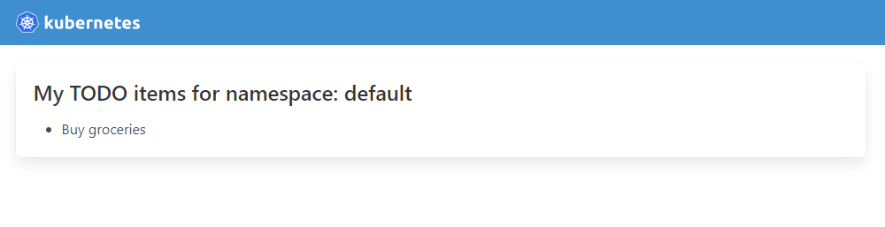

# Kubernetes Controller Example

This is an example application that uses Kubernetes Custom Resource Definitions to keep a list of TODO actions, but stored in Kubernetes.

The application is a custom resource definition, namespaced.

The code in this repository **is not production ready**. It's merely an example repository for training purposes.



## Prerequisites

The following apps are required:

* Kubernetes `kubectl`
* Docker
* Kind

The stack uses [Kind](https://kind.sigs.k8s.io/) to launch a cluster locally, then deploy the controller there. Since this controller relies on a Docker container, see below for instructions on how to send the Docker image once built to the Kubernetes Kind cluster.

To launch a cluster with a single node mappings port 80 and 443 to 80 and 443 on given node, use [`kind/cluster.yaml`](kind/cluster.yaml):

```bash
kind create cluster --config kind/cluster.yaml
```

If using a different cluster engine other than Kind, ensure you perform the appropriate modifications to the [`controller/controller.yaml`](controller/controller.yaml) file so it uses the proper Docker image. See below for more details.

## Application structure

```text
.
├── controller
│   ├── controller.yaml
│   ├── Dockerfile
│   ├── go.mod
│   ├── homepage.tmpl
│   ├── kubernetes.go
│   ├── main.go
│   ├── req_logger.go
│   ├── res_utils.go
│   └── utils.go
├── kind
│   └── cluster.yaml
├── kubernetes
│   ├── crd-use.yaml
│   └── crd.yaml
└── README.md
```

## Kubernetes & CRD

The [`kubernetes`](kubernetes) folder contains two files:

* The CRD itself, named [`crd.yaml`](kubernetes/crd.yaml) which is used to create a resource named `Todo` in Kubernetes.
* The usage of given CRD, called [`crd-use.yaml`](kubernetes/crd-use.yaml). This is used to create an initial TODO object.

## Go Application

The [`controller`](controller) folder includes a Go application that reads from the Kubernetes API server any resource typed `Todo`.

The application **does not use the `kubernetes/client-go` to interact with the Kubernetes API**. Since the idea of this repository is to provide a baseline for training, it uses instead pure HTTP calls. It does ensure, however:

* That the HTTP client is configured to talk to the Kubernetes API using the CA certificate from the `ServiceAccount`.
* That the token and current namespace are captured from the `ServiceAccount` details automatically mounted in the container.

It's possible to use a sidecar container to avoid having all this logic here: the sidecar container can run `kubectl proxy` and this app can interact then with the sidecar's host and port to perform preauthenticated requests against the API.

The Go application uses a very simple Vue UI which loads both the namespace the controller is running at, as well as any `Todo` in it, and returns it back to the UI using Javascript's `fetch()`.

### Compiling the application

The application uses a Docker multi-stage build to compile the application and avoid having to build it locally. You can perform simple tests by running this app in your own machine rather than in the cluster, if at the same time you use `kubectl proxy` to allow for unauthenticated local access to the Kubernetes API. Then, simply configure the environment variables so the controller knows where to connect to the Kubernetes API. In this case, those environment variables are in [`controller/.env`](controller/.env):

```bash
KUBERNETES_API_HOST=http://localhost:8080
KUBERNETES_CONTROLLER_PORT=8081
```

Run the application with these environment variables set, and in another terminal, run:

```bash
kubectl proxy --port 8080
```

That way, the controller connects to your `kubectl proxy` on port `8080`, but the app itself with the UI is available in `localhost:8081`.

### Running the application

In order for the application to run in a cluster, you need:

* To have the Docker container either stored in a Registry or loaded into the Cluster
* To allow the controller to have access to the Kubernetes API, and specifically, to the `Todo` resource in the current namespace

To achieve the first point while using Kind, you can build the Docker image locally, then load it into the cluster using the `kind` CLI:

```bash
$ docker build -q -t demo-controller -f controller/Dockerfile controller/
sha256:4a711a67ac8cb79f555bf736f72bf7eff3febf918895499b7f2c2093f3ca1cbe

$ kind load docker-image demo-controller:latest --name testing-cluster
Image: "demo-controller:latest" with ID "sha256:4a711a67ac8cb79f555bf736f72bf7eff3febf918895499b7f2c2093f3ca1cbe" not yet present on node "testing-cluster-control-plane", loading... 
```

You can use the image now. If you're using Kind, make sure the `imagePullPolicy` is set to `IfNotPresent` to ensure it uses the copy of the image we just loaded rather than grabbing one from Internet.

In order to have a full controller, a deployment has been provided using the [`controller/controller.yaml`](controller/controller.yaml) file. This file will:

* Create a service account named `example-controller-service-account`
* Create a Role which has access to list `todos`
* Bind the Service account to the Role using a Role Binding
* Finally, deploy the controller using a Deployment, which maps port `8080` as `web`

You can install this manifest using:

```bash
$ kubectl apply -f controller/controller.yaml
serviceaccount/example-controller-service-account created
role.rbac.authorization.k8s.io/example-controller-role created
rolebinding.rbac.authorization.k8s.io/example-controller-rolebinding created
deployment.apps/example-controller created
```

You can access the application running here by using Kubernetes port-forward. The example below will use `awk` to find the appropriate pod then expose it on port `1234`:

```bash
$ kubectl get pods --show-labels | awk '/example\-controller/ { print $1 }' | xargs -I{} kubectl port-forward --address 0.0.0.0 pod/{} 1234:8080
Forwarding from 0.0.0.0:1234 -> 8080
```

Alternatively, you can build a `Service` out of it and expose it, or top it off with an `Ingress`. The sky is the limit.
